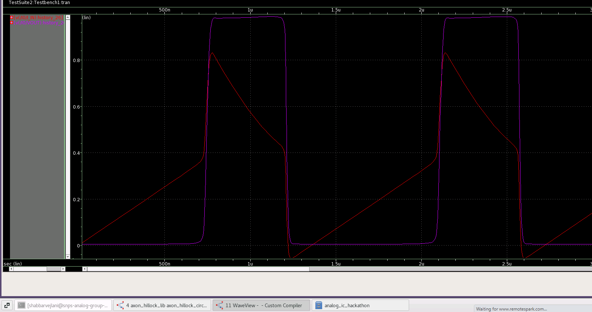

# Axon_HillLock_Circuit_Neuromorphic_Circuit_Implementation

## Table of Contents
1. [Introduction](#introduction)
2. [Working](#working)
3. [Reference Circuit](#reference-circuit)
4. [Implementation](#implementation)
5. [Schematic Netlist](#schematic-netlist)
6. [Simulation result](#simulation-result)
7. [Challenge](#challenge)
8. [Limitations](#limitations)
9. [References](#references)
10. [Acknowledgements](#acknowledgements)
11. [Author](#author)

## Introduction

Neuromorphic Circuits are a biologically inspired way of implementing computation using analog circuits. They offer low power advantage for applications like machine learning inference on the edge devices. The biological neuron consists of various parts like dendrite, soma and axon which receive electrical pulses from various sensory organs and transmit and process information in the form of electrical pulses.  The analog equivalent neuron consists of various computational building blocks  like temporal integration block, spike/event generation block, refractory period block, spike-frequency adaptation block and spiking threshold adaption block. This paper implements the spike/event generation block using the axon-hillock circuit in SAED_PDK_28_30 CMOS technology. The axon-hillock circuit uses integrate and fire model for spike generation. The input comes in the form of current which is integrated and when it reaches a threshold, a pulse is emitted from the neuron.

## Working

The Axon Hillock is a portion of the neuron which mimics the Spike/Event Generation within the neuron after receiving weighted sum inputs from the soma. The reference circuit (Figure 1, Ref[1]) models the spike generation using the  integrate and fire model. This is implemented by using :
1. A capacitor integrating an input current 
2. A high gain non-inverting amplifier in positive feedback configuration
3. An auxiliary circuit which helps in the pulse generation whenever the integrator reaches a particular threshold

- The input current Iin is integrated using capacitor Cmem. 
- The high gain non-inverting amplifier is implemented using back-to-back CMOS inverters(Q3, Q4, Q5, Q6). 
- The feedback network is implemented using capacitors Cfb and Cmem. 
- The auxillary circuit uses cascaded NMOS pair(Q1 and Q2), where the lower transistor gate voltage (Vb) provides a control on the rate of discharge, thus also determining the output pulse width(tH).


## Reference Circuit

<p align="center">
	 
	<h5 align="center">Figure 2: Axon HillCircuit Reference Schematic</h5>
</p>

<p align="center">
	 
	<h5 align="center">Figure 3: Axon Hill Reference Waveform</h5>
	</p>

## Implementation
- The MOSFET model chosen is TT model from 28nm PDK.

<p align="center">
	 
	<h5 align="center">Figure 4: Axon Hillock Circuit Implementation Schematic</h5>
	 
	<h5 align="center">Figure 5: Axon Hillock Circuit Simulation Schematic</h5>
	 
	<h5 align="center">Figure 6: Simulation Setup Axon Hillock Circuit.png</h5>

## Schematic Netlist

The final netlist is as follows: 

```
*Custom Compiler Version S-2021.09
*Sat Feb 26 19:32:37 2022

*.SCALE METER
*.LDD
.GLOBAL gnd!
********************************************************************************
* Library          : axon_hillock_lib
* Cell             : axon_hillock_circuit
* View             : schematic
* View Search List : auCdl schematic
* View Stop List   : auCdl
********************************************************************************
.subckt axon_hillock_circuit GND I_IN VDD VOUT Vb
*.PININFO GND:B I_IN:I VDD:B VOUT:O Vb:I
MM4 I_IN VOUT net21 GND n105 w=0.2u l=0.03u nf=2 m=1
MM5 net21 Vb GND GND n105 w=0.2u l=0.03u nf=2 m=1
MM1 VOUT net16 GND GND n105 w=0.1u l=0.03u nf=1 m=1
MM0 net16 I_IN GND GND n105 w=0.1u l=0.03u nf=1 m=1
MM3 VOUT net16 VDD VDD p105 w=0.1u l=0.03u nf=1 m=1
MM2 net16 I_IN VDD VDD p105 w=0.1u l=0.03u nf=1 m=1
CC7 I_IN GND 'Cmem' $[CP]
CC6 I_IN VOUT 'Cfb' $[CP]
.ends axon_hillock_circuit

********************************************************************************
* Library          : axon_hillock_lib
* Cell             : sim_axon_hillock_circuit
* View             : schematic
* View Search List : auCdl schematic
* View Stop List   : auCdl
********************************************************************************
.subckt sim_axon_hillock_circuit
XI0 gnd! net7 net8 net12 net10 axon_hillock_circuit
RR7 net12 gnd! 10meg $[RP]
.ends sim_axon_hillock_circuit
```

- Netlist is generated by using Custom Compiler.


## Simulation result

- Custom Compiler Waveform

### Transient Analysis:
<p align="center">
 
<h5 align="center">Figure 9: Transient Waveform (Zoom In)</h5>
</p>

<p align="center">
 
<h5 align="center">Figure 9: Transient Waveform (Zoom Out)</h5>
</p>

## Challenge


## Limitations


## References
1. Chapter 12, “Axons” from text “Analog VLSI and Neural Systems”, Mead Carver.
2. Giacomo Indiveri et al “Neuromorphic silicon neuron circuits”, Fronetiers in Neuroscience Online Journal.

## Acknowledgements
- [Indian Institute Of Technology (IIT), Hyderabad](https://iith.ac.in/)
- [Kunal Ghosh](https://github.com/kunalg123), Founder, VSD Corp. Pvt. Ltd
- [Synopsys](https://www.synopsys.com/)

## Author
Shabbar Vejlani, Digital Verification Engineer, Bangalore.


